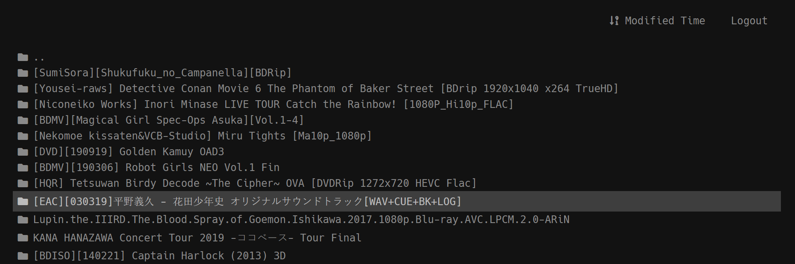

# Google Drive Directory

A Cloudflare Worker based front-end and back-end that gives you a reversed proxy for your Google Drive contents!

## Features

-   Supports both User Accounts (UA) with OAuth2 token, and Service Accounts (SA) with JWT token.
-   Unlimited account rotation algorithm. No more 403 error!
    -   Choose a candidates window of 10 accounts every 1 minute, and randomly pick one account from the window for every request.
    -   Listing requests that carry page tokens will use the previous account to avoid paging problems.
-   User login support. Admin can create users with password and optional whitelist and blacklist drive IDs.
-   Search support with permission enforcements.
-   Use GitHub, Gist, or any free static hosting services to host your encrypted account credentials, user settings, and static resources! Cloudflare Worker itself can only allow 1MB program data.
-   Dark Mode! Yeeeeeeeeee!
-   React.js for front-end render.
-   Written in TypeScript with Gulp tasks! Make development easy!



## Setup

-   Install [Git](https://git-scm.com/), [Node.js with NPM](https://nodejs.org/en/download/), [Golang toolchain](https://golang.org/dl/).
-   Follow [AutoRclone](https://github.com/xyou365/AutoRclone) guide to create your pool of Service Accounts.
-   I recommend adding all your Service Accounts into a Google Group to make it simple for adding all Service Accounts into a Team Drive.

Clone this repository with the following command:

```
git clone https://github.com/workerindex/gdir.git
```

Under `gdir` folder, run the following command to launch the interactive setup program:

```
go run ./tools/setup
```

Then follow the instructions to setup and deploy your gdir instance.

**Note:** Windows users may or may not experience with random failures during `npm install`. Typically with failure messages like `Error: PERM: operation not permitted`. This is usually your antivirus is reading some files while npm is trying to remove them. Try turning off your antivirus, remove the `node_modules` folder and try again.

## Add / Edit Users

To add more users, run the following command:

```
go run ./tools/adduser
```

Then follow the instructions to add, edit, and deploy users.

## Development

Launch a dev server with `npm run dev`. This will watch for any changes in source code and rebuild the component. It will start a local [Cloudworker](https://blog.cloudflare.com/cloudworker-a-local-cloudflare-worker-runner/) server that simulates the Cloudflare Worker environment. So you don't need to deploy to your actual Cloudflare account for development.

## Say Hi

You are welcome to join our [Telegram Group](https://t.me/gdirectory)!
